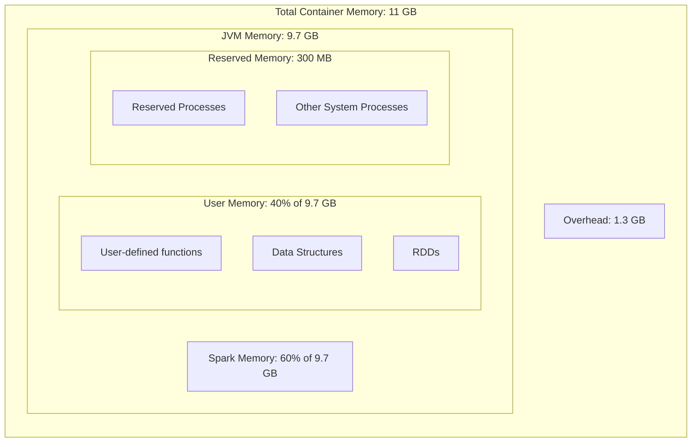

## Spark SQL Engine
- What is catalyst optimiser? 
- Spark SQL Engine.
- why we get analysis exception error ?
- what is physical planning / spark plan ?
- is spark engine a compiler ? Yes
- How many phases are involved in spark SQL engine to convert a code into java byte code? 4
  
## RDD
 - What is RDD? 
   - Resilient distributed dataset.
 - when do we need an RDD?
 - Features of an RDD? 
 - what is data frame / dataset?
 - why we should not use an RDD?
 - RDD is used for unstructured data and dataset, data Frame API is used to structured data 

## Re partition and coalesce
- Use to manually partition the RDD. 
- Cannot partition the data frame/dataset first need to convert it into the rdd and then re-partition or coalesce happens.
- #### Difference between Re-partition and RDD. 
  | Re-partition                                  | Coalesce                              |
  | -------------------------------------------- | ------------------------------------- |
  | May decrease or increase the no. of partition | Only decreases the no of partition.   |
  | a lot of data shuffling.                     | No data shuffling at all.              |
  | Creates equal size of partitions.            | Creates uneven sized data partitions. |

## Joins in spark 
- types of joins in spark.
- join strategy in spark 
- #### shuffle sort merge join vs shuffle sort hash join 
  | Merge Join                                                | Hash Join                                                                  |
  | --------------------------------------------------------- | -------------------------------------------------------------------------- |
  | merge join is a CPU bound and does not require any memory | hash join takes in memory computation and can ran out of Out of RAM easily |
  | spark by default uses merge join                           | spark by default does not uses merge join                                   |
  | O(nlogn) Time complexity of a operation                   | O(1) Time complexity of a operation                                        |
- #### Broadcast Hash Join
  - Difference between broadcast hash and shuffle hash join.
  - When it is bad?
    - If the smaller dataset is too large to fit in memory, broadcast hash join can lead to excessive memory consumption. Broadcasting data also requires additional memory on the driver node to hold the data before sending it to worker nodes.
  - When both tables are large, getting the broadcast join may lead to out-of-memory issues. In that case, Shuffle Hash Join can be a better option. 

## (Spark Memory Management) Driver out of Memory.
 - What is OOM?
 - Common reason for OOM?
    1. collect method is used.
    2. broadcast 
    3. more objects are used in the process.
    4. Wrong configuration.
   
 - ### Driver Memory 
  - only JVM process runs in `Spark.driver.memory`. (*if size is 1 GB* )
  - Non JVM Processes, container's processes and objects are saved in `spark.driver.memoryOverhead`. *(10% or 384 MB whichever is higher.)*

## Executor Memory Management (Executor OOM)
- [Watch this video for explaination](https://www.youtube.com/watch?v=b2hO1oJf9nA&list=PLTsNSGeIpGnGkpfKMf7ilFmzfx6AjMKyT&index=18)
- Parts of spark executor memory.
  - spark.executor.memory = 10GB
  - spark.executor.MemoryOverhead = 10% of executor memory.

## Spark Submit

## Deployment modes in Spark

  - What all deployment modes are there in spark?
  - what is edge node?
  - why do we need client and cluster modes?
  - what will happend if I close my edge node?
  

## Adaptive Query Execution (AQE) in Spark

  - What is AQE?
    - It gives the flexibility to change the query execution in runtime. 
    - Only works in spark 3.0
    - When the partiton is skewed AQE happens.
    - If the skewed partition is 5 times of the median partition or larger than 250 mb it is consider to as a skewed partition.
  
### Cache and persist

### 